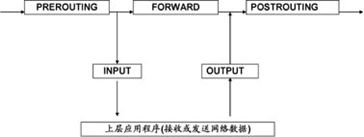

# iptables 有这一篇就够了

 2019-09-09*20:28:33*[2](https://www.hugbg.com/archives/766.html#comments) 2391字阅读7分58秒

摘要

iptables 是一款开源的，工作在OSI的二三层，基于包过滤的防火墙工具，简洁，强大。—工作在网络或者主机的边缘,对进出的报文进行控制修改。

### 1.1 iptables防火墙简介

   Linux系统的防火墙功能是由内核实现的。在2.4 版及以后的内核中，包过滤机制是netfilter，管理工具是**iptables**。

   **Netfilter**，位于Linux内核中的包过滤防火墙功能体系，称为Linux防火墙的“内核态”。 **Iptables**，位于/sbin/iptables，是用来管理防火墙的命令工具，为防火墙体系提供过滤规则/策略，决定如何过滤或处理到达防火墙主机的数据包，称为Linux防火墙的“用户态”，也就是我们常说的*iptables*。

- netfilter: 工作在内核中的过滤框架， 真正起作用；
- iptables: 工作在用户空间，生成过滤规则 NAT、mangle, 是netfilter的管理工具；

#### 1.1.1 netfilter 框架

  在我看来，所谓网络其实就是*数据包的转发*，各种网络架构就是为了 高效、安全的转发数据包。

  而netfilter 作为Linux内核的一个网络子系统，它在OSI的二层和三层，构造了五个钩子函数*（Prerouting，Input，Output，Forward，Postrouting 后面会说这五个函数）*，通过这五个钩子函数，就是可以完全控制，所有本机发出的，或者流经本机的数据包，可以为iptables内核防火墙模块提供有状态或无状态的包过滤服务，如NAT、IP伪装等，也可以因高级路由或连接状态管理的需要而修改IP头信息。

 虽然防火墙模块构建在Linux内核，并且要对流经IP层的数据包进行处理，但它并没有改变IP协议栈的代码，而是通过netfilter模块将防火墙的功能引入IP层，从而实现防火墙代码和IP协议栈代码的完全分离。

#### 1.1.2 应用场景

1. 主机防火墙（filter 表的 INPUT 链）；
2. 转发上网 *（NAT表的 postrouting , 生产服务器，四块网卡 两两绑定，一内一外，外网网卡将外网流量转发至NAT网关，网关可以是iptables服务器，在转发到出口路由器或出口防火墙，内网网卡则只是内网通信。）*；
3. 端口及IP映射 （一对一映射NAT 表的prerouting链）

### 1.1.3 iptables 工作流程

   iptables 是基于包过滤工作的，它会对接收的数据包的包头数据进行分析，然后根据预先设定好的规则，进行匹配决定是否可以进入主机。

请求数据-------------> IPTABLES: Filter --------------------> 主机 Service

​       / 数据包     请求数据包        Accept \

​      /                                       \

​    /                   |                        \

丢弃数据包<---DROP---- **规则 1** ---ACCEPT--> 转发到主机Service

​                       |

丢弃数据包<---DROP---- **规则 2** ---ACCEPT--> 转发到主机Service

​                       |

丢弃数据包<---DROP---- **规则 3** ---ACCEPT--> 转发到主机Service

**iptables 工作流程小结：**

1. 数据包按照配置的规则顺序，从上往下，一层层过滤；
2. 数据包如果满足，配置的规则条件，并明确表示，**通过或拒绝**，则不再向下匹    配；
3. 如果匹配的规则，没有明确的拒绝或通过，则继续向下匹配；

4.从小往下，所有规则都不匹配，则执行**默认规则**。

#### 1.1.4 NetFilter匹配过程

从图中可以看到，数据包从左边进入IP协议栈，进行IP校验以后，数据包被PREROUTING处理，然后就进入路由模块，由其决定该数据包是转发出去还是送给本机。若该数据包是送给本机的，则通过INPUT处理后传递给本机的上层协议；若该数据包应该被转发，则它将FORWARD处理，然后还要经POSTROUTING处理后才能传输到网络。本机进程产生的数据包要先经OUTPUT处理后，再进行路由选择处理，然后经过POSTROUTING处理后再发送到网络。

**五条规则链（chain）：**

iptables防火墙使用不同的规则对数据包进行过滤或处理，根据处理时机的不同，各种规则被组织在不同的“链”中。

规则链是防火墙规则/策略的集合，默认iptables防火墙包括了5种规则链，也就是前面提到的五个钩子函数。

- INPUT：处理入站数据包
- OUTPUT：处理出站数据包
- FORWARD：处理转发数据包
- POSTROUTING链：在进行路由选择后处理数据包
- PREROUTING链：在进行路由选择前处理数据包

**四张规则表（table）：**

- raw表：确定是否对该数据包进行状态跟踪
- mangle表：为数据包设置标记
- nat表：修改数据包中的源、目标IP地址或端口
- filter表：确定是否放行该数据包（过滤）

mangle表可以对数据包进行特殊标记，结合这些标记可以在filter表中对数据包进行有选择性的处理（如“策略路由”，举个例子，网关主机有两条ADSL线路，分别使用网通、电信的接口，可以将访问网通服务器的数据交给网通ADSL接口，而访问电信服务器的数据交给电信ADSL接口）。

raw表是自iptables自1.2.9以后版本后新增的表，主要用于决定数据包是否被状态跟踪机制处理，目前raw表中的应用尚不多见。本书的重点主要介绍filter表和nat表。

整个表、链结构可以理解为在内核运行空间的一块区域，划分为4个表，表内再划分为不同的链，链内为用户定义的规则。下图为表、链的结构图：

iptables 表、链结构图

policy ----》rule（规则）-----》chain（链）----》table（表）--------》IPTABLES